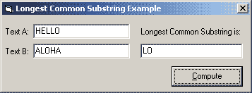



## Longest Common Substring

### Description

This code shows how to find a longest common substring in two strings.

I had a hard time finding out how exactly to do this so now that I have done it I'm sharing it to help others that need it.
 
### More Info
 
The LongestCommonSubstring function is currently case-insensitive but that can be easily fixed so it is case-sensitive. Also the function will return the first longest common substring it finds if there are two common substrings of the same length.

             |
---                |---
**Submitted On**   |2004-06-17 00:33:32
**By**             |[TiCaL](https://github.com/Planet-Source-Code/PSCIndex/blob/master/ByAuthor/tical.md)
**Level**          |Intermediate
**User Rating**    |5.0 (20 globes from 4 users)
**Compatibility**  |VB 5\.0, VB 6\.0
**Category**       |[String Manipulation](https://github.com/Planet-Source-Code/PSCIndex/blob/master/ByCategory/string-manipulation__1-5.md)
**World**          |[Visual Basic](https://github.com/Planet-Source-Code/PSCIndex/blob/master/ByWorld/visual-basic.md)
**Archive File**   |[Longest\_Co1758036172004\.zip](https://github.com/Planet-Source-Code/tical-longest-common-substring__1-54427/archive/master.zip)

